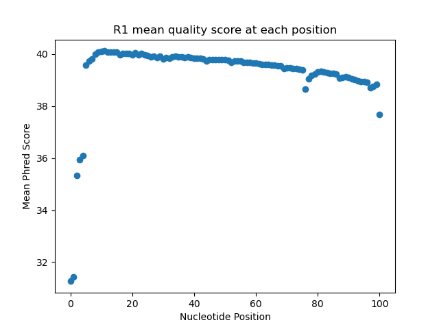
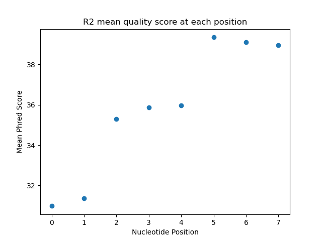
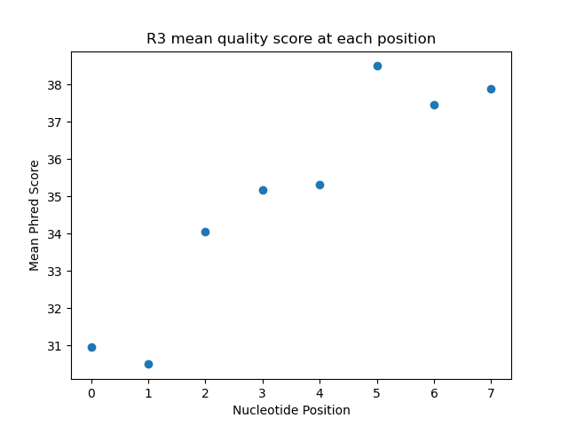
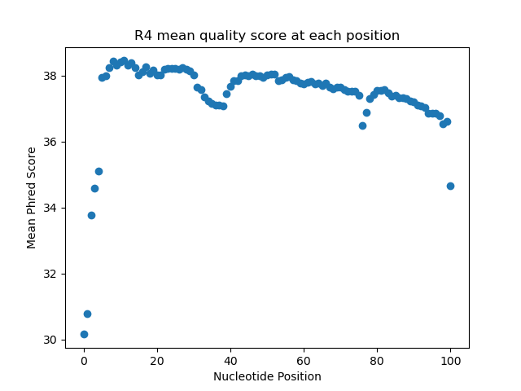

# Assignment the First

## Part 1
1. Be sure to upload your Python script. Provide a link to it here: [Part1.py](./Part1.py)

| File name | label | Read length | Phred encoding |
|---|---|---|---|
| 1294_S1_L008_R1_001.fastq.gz |read1  |101  |Phred+33  |
| 1294_S1_L008_R2_001.fastq.gz |index1  |8  |Phred+33  |
| 1294_S1_L008_R3_001.fastq.gz |index2  |8  |Phred+33  |
| 1294_S1_L008_R4_001.fastq.gz |read2  |101  |Phred+33  |

2. Per-base NT distribution
    1. Use markdown to insert your 4 histograms here.
      
      
      
    
    <br>
    2. **I would choose a Q score cutoff of 30 per base of an index read. Since an error in an index read can potentially lead to reads being incorrectly assigned to  samples, I want to make sure each base call in an index read has a high confidence, and a score of 30 means there's only a 1/1000 probability that the base is incorrect. For my biological read cutoff, I would choose a Q score of 30 for the mean of the read. My reason for evaluating the mean instead of each base is that the biological reads tend to have low quality base calls towards the beginning/end of the read that should not majorly affect alignment to the genome if the rest of the sequence is high quality.**<br>
    
    3. **7304664 undetermined barcodes (3976613 in R2; 3328051 in R3)**<br>
    Commands:  
    ```
    zcat 1294_S1_L008_R2_001.fastq.gz | grep -A 1 --no-group-separator "^@" | grep -v "^@" | grep -c "N"  

    zcat 1294_S1_L008_R3_001.fastq.gz | grep -A 1 --no-group-separator "^@" | grep -v "^@" | grep -c "N"
    ```
    
## Part 2
1. Define the problem<br>
**The problem is that there are data associated with different barcodes in each of the 4 fastq files since the 24 samples were multiplexed during sequencing, and we need to separate the barcodes into different files to make downstream analysis possible. Additionally, there are reads with invalid barcodes, indexes that hopped, and low quality indices, which we need to separate from the reads with proper dual-matched indices.**
2. Describe output
- Total number of swapped indexes and percentage breakdown of specific index pairs that swapped with each other
- Frequency of "N" base calls in unknown barcodes
- Barplot of number of reads per barcode/sample
- Number of reads and percentage that was dual-matched, hopped, or unknown

3. Upload your [4 input FASTQ files](../TEST-input_FASTQ) and your [>=6 expected output FASTQ files](../TEST-output_FASTQ).
4. Pseudocode
5. High level functions. For each function, be sure to include:
    1. Description/doc string
    2. Function headers (name and parameters)
    3. Test examples for individual functions
    4. Return statement  
**Pseudocode and functions are in [pseudocode.md](./pseudocode.md)**
